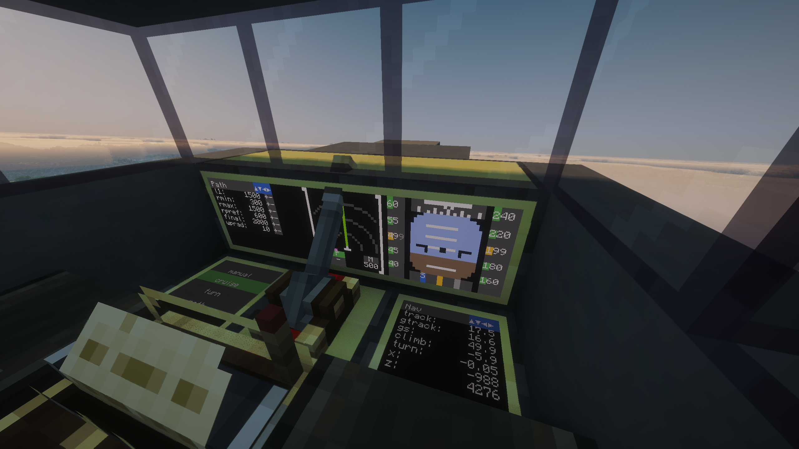
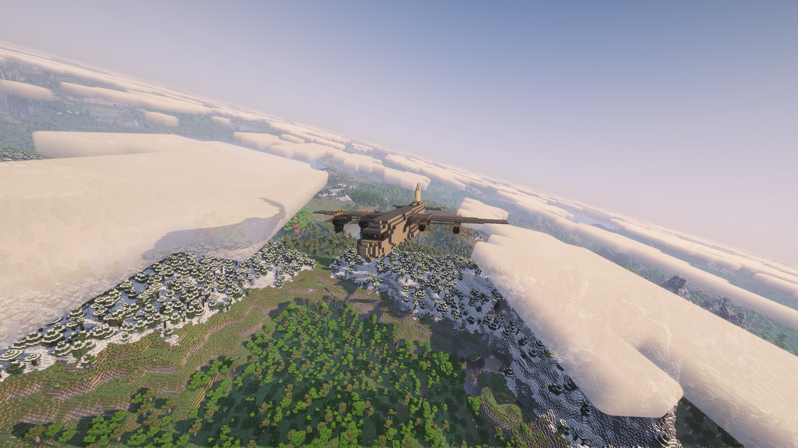
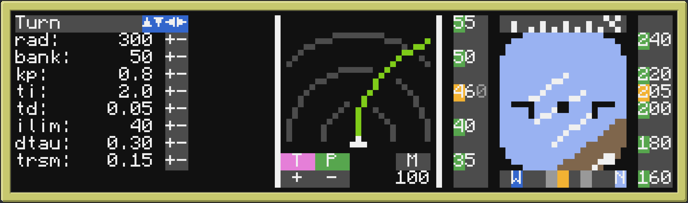

# CC Aeronautics Fly-By-Wire

> ### 🚧 Work in progress
>
> It flies, holds altitude, and the glass cockpit is live, but this is an
> active hobby project with half-built corners. See
> [what I'm working on](#what-im-working-on).

A fly-by-wire avionics stack for a player-built aircraft, written in Lua and
running on in-game computers.

The aircraft is built in [Create: Aeronautics][aero], a Minecraft mod that adds
buildable aircraft on top of a basic physics simulation. Wings generate lift on
a rigid body, control surfaces change how forces land on the airframe, and the
whole thing responds to what you do to it. It is not a full aerodynamics model,
but it is realistic enough that flying well demands the same solutions a real
airframe would.

This is the software in between. It reads sensors, closes control loops at
20 Hz, surveys its own position off ground beacons, and renders a multi-screen
glass cockpit.

[aero]: https://modrinth.com/mod/create-aeronautics

**▶ Demo video:** [Flight Computer Demo (Create: Aeronautics)](https://youtu.be/t6LDE93niSI)





## Features

- **Four flight modes.** `manual` for direct control, `cruise` for altitude and
  wings-level hold, `turn` for a commanded turn radius, and `path` for waypoint
  following (work in progress).
- **A glass cockpit.** A PFD with artificial horizon, pitch ladder, bank scale,
  airspeed and altitude tapes and a heading compass. An ND moving map with
  range rings, ownship, predicted flight path and zoom. Config and tuning
  panels alongside them.
- **Live-tunable in flight.** Every gain can be changed from the cockpit
  without landing, and it persists across reboots. Iteration takes seconds
  instead of a round trip through the file system.

## What makes it hard

- **Physics.** The aircraft has wings that apply a lift force to a rigid body,
  and the control surfaces are real. Their orientation in space changes how
  forces are applied to the airframe, and therefore how the plane flies.
  Nothing about that can be faked, so it needs real answers. PID control, and
  servo actuation that steps the bearings and reads their angles back.
- **No GPS.** Nothing reports position, so it has to be surveyed. Getting a
  usable fix at all was a challenge, and it matters most to `path` mode, which
  is still rough. Right now it overshoots its trajectory and does not plan the
  path properly.
- **Yielding costs ticks.** Peripheral calls block, so twenty of them in
  sequence turns a 50 ms control loop into a one-second one. Threading the
  calls is what keeps the loop at rate.
- **Multi-computer architecture.** Two computers have to agree about the state
  of one aircraft over a radio link. Designing the protocol and keeping both
  ends in sync has been the fiddliest part of the project.
- **Terminal display limitations.** A monitor can only show characters with a
  foreground and a background colour. Anything that looks like drawing has to
  be built out of that.

---

## Architecture

Two computers over wireless rednet.

```
              ┌────────────────────────────┐
              │   COCKPIT   (hud/)         │
              │                            │
pilot keys -->│  input sampler             │
              │  PFD / ND renderer         │
              │  tuner panels              │
              │  link watchdog             │
              └──────────────┬─────────────┘
                             │
                             │   HUD -> FC   INPUT, MODE, PARAM, COMMAND, TARGET
                     rednet  │   FC -> HUD   TELEMETRY, CONFIG, ACK
                      "fcs"  │               both streaming at 20 Hz
                             │
              ┌──────────────┴─────────────┐
              │   AIRFRAME  (fc/)          │
              │                            │
   sensors -->│  read_sensors()   SENSE    │
              │  mode.tick(dt)    THINK    │
              │  ticker()         ACT      │ --> actuators
              └────────────────────────────┘
```

The **flight computer** (`fc/`) owns the aircraft. It trusts the cockpit for
intent only, meaning pilot axes, mode changes, discrete commands and tuning
parameters. Three coroutines run in parallel (event scheduler, control loop,
slow fuel gauge) inside a crash handler that neutralises every control surface
before it lets the program die.

The **cockpit computer** (`hud/`) owns the human. It samples the keyboard and an
analogue throttle lever, streams normalised axes, and renders telemetry. It
holds no authority. If the link drops it says so and stops sending.

### The control loop

Each tick runs in a strict order of sense, think, act.

```lua
read_sensors()              -- 1. SENSE: peripheral reads, fanned out in parallel
modes[state.mode].tick(dt)  -- 2. THINK: pure computation, no yields
ticker()                    -- 3. ACT:   peripheral writes, fanned out, yields 1 tick
```

Sense and act wrap every peripheral call in `parallel.waitForAll`, so sixteen
blocking reads cost one tick instead of sixteen. Think is deliberately pure,
with no yields, so a mode can't be suspended halfway through computing a
command.

### Wire protocol

A tagged-table protocol (`common/proto.lua`) with sender filtering on both ends.

| Message      | Direction | Payload                                    |
| ------------ | --------- | ------------------------------------------ |
| `HELLO`      | both      | handshake / liveness probe                 |
| `INPUT`      | HUD → FC  | `{pitch, roll, yaw, throttle}`, 20 Hz      |
| `MODE`       | HUD → FC  | `{mode}`                                   |
| `COMMAND`    | HUD → FC  | gear toggle, ramp toggle, flaps set        |
| `TARGET`     | HUD → FC  | `{alt, spd, hdg}`                          |
| `PARAM`      | HUD → FC  | one live gain change, e.g. `cruise_alt_kp` |
| `CONFIG_REQ` | HUD → FC  | ask for the current parameter set          |
| `TELEMETRY`  | FC → HUD  | full state snapshot, 20 Hz                 |
| `CONFIG`     | FC → HUD  | the whole parameter table                  |
| `ACK`        | FC → HUD  | `{of, ok, err, echo}`                      |

---

## The glass cockpit

CC:Tweaked monitors are bad at smooth graphics. A monitor is a grid of
characters, each with one foreground and one background colour, and that is the
entire drawing surface. `hud/lib/` is a small UI toolkit built to get something
that reads like an instrument out of it.



Three panes share the main monitor.

On the left, a **tuning page** for whichever mode is active. Here it is `turn`,
with its radius and bank targets and the gains underneath, each on a stepper
that pushes the change straight to the flight computer. On the right, the
**PFD**, with the artificial horizon and pitch ladder in the middle, airspeed
and altitude tapes down either side, and the heading compass along the bottom.
Between them, the **ND**, showing range rings, the ownship, and the predicted
flight path curving away ahead of it.

Getting that out of a character grid takes a bit of work. It renders into a
**bixel buffer** at 2×3 the character resolution and packs each cell into a
drawing glyph, which is how the horizon rotates smoothly instead of in a
staircase. On top sits a per-pixel **priority buffer**, so the ownship symbol
always wins over the pitch ladder and the bezel mask always wins over both,
regardless of draw order. The whole frame goes through a double-buffered
`window`, so a moving display presents at once instead of tearing.

---

## Under the hood

### Cascaded PID with proper anti-windup

`fc/flight/util.lua` implements PID in standard form
(`out = Kp·(e + (1/Ti)·∫e + Td·de/dt) + bias`) with the details that matter once
actuators saturate.

- **Derivative on measurement**, not error, so a setpoint step doesn't kick the
  output.
- **Conditional integration.** The increment is computed, the output evaluated
  *tentatively*, and the increment committed only if it isn't pushing further
  into saturation. Real anti-windup, not a clamp after the fact.
- **The integral is stored as its output contribution** in degrees, which makes
  `i_limit` a physically meaningful "never let the integral term alone deflect
  more than N degrees".

Altitude hold is a cascade. An outer loop turns altitude error into a target
pitch attitude, an inner loop turns pitch error into elevator deflection, and a
third holds the wings level. `fc/flight/relay_tuner.lua` starts on a
relay-feedback autotuner for identifying the gains automatically.

### Live tuning over the air

Tuning a PID by editing a file, rebooting, and taking off again is unbearable.
Gains live in a schema (`fc/params.lua`) where each one declares how it
persists, either `global`, per-`profile`, or not at all, and they change
mid-flight on a single `PARAM` message. The flight computer writes through to
CC:Tweaked's settings store, so tuning survives a reboot or a crash.

### Position fixing by resection

`fc/flight/resect.lua` gave me more headaches than anything else in the project.

Three ground beacons each have a navigation table aimed at them, reporting a
bearing relative to the airframe, and a fourth is magnetised to point north.
Because heading is *known* rather than solved for, the fix intersects bearing
lines instead of circles, which drops the heading ambiguity and the degenerate
geometry that classical three-point resection suffers from.

The hard part is that the aircraft tilts and the beacons sit at a different
altitude, so every bearing has to be rotated out of the airframe's frame and
corrected for line-of-sight elevation. Elevation depends on position and
position depends on elevation, so a fixed-point loop settles it in two or three
passes. It reports its own residuals as well, which is what separates a bad
beacon reading from an attitude too steep to trust.

---

## Running it

> ### ⚠️ Not really ready for anyone else to run
>
> I have tried to keep the code general, but it is still fitted to my aircraft,
> and running it means building that aircraft first. I haven't published blueprints
> and I don't expect anyone to deploy this as it stands. What follows is roughly
> how you would go about it, not instructions that will necessarily work.

### Requirements

Minecraft **1.21.1**, **NeoForge**. Developed inside a much larger pack, but
only these matter.

| Mod                                   | What it provides                                                                                                                |
| ------------------------------------- | ------------------------------------------------------------------------------------------------------------------------------- |
| **CC: Tweaked**                       | the computers, monitors, wireless modems, Lua runtime                                                                           |
| **CC: Bridge**          | Create blocks as peripherals (rotation speed controllers, stressometer, speedometers) and the linked typewriter used as the yoke |
| **Create**                            | rotational power, the speed controllers driving every actuator, fluid tanks                                                     |
| **Create: Aeronautics** (+ **Sable**) | the airframe as a physics body, swivel bearings, and the altitude / velocity / gimbal sensors and navigation tables             |

### Roughly how it goes together

The airframe needs control surfaces on swivel bearings for elevators, ailerons,
rudder and flaps, each driven by its own rotation speed controller, plus the
altitude, velocity and gimbal sensors and a set of navigation tables. One
computer goes on the airframe and one in the cockpit, each with a wireless
modem. Three ground beacons at known coordinates carry the navigation targets,
and a fourth navigation table is magnetised for heading.

`fc/` goes on the airframe computer and `hud/` in the cockpit, each at the
filesystem root. Both need `common/` present locally, which is why it is
checked in at `fc/common/` and `hud/common/`.

Everything specific to an airframe lives in the two config files.
`fc/config.lua` maps every peripheral by name and carries the axis sign
conventions and the beacon coordinates. `hud/config.lua` does the same for the
monitors and the typewriter. The sign conventions exist because a bearing or
sensor ends up oriented however it was when you placed it, so expect to flip
several of them before anything flies straight.

After that the gains need tuning to the aircraft's mass and wing area, which is
what the tuner panels are for.

### Repo layout

```
common/           protocol, rednet wrapper, math helpers, multi-target logger
fc/               flight computer (control loop, modes, params, recovery)
  flight/           PID / Servo / Throttle, resection, relay autotuner
hud/              cockpit computer (input, link watchdog, displays)
  lib/              current UI toolkit (slate) with panes, PFD, ND, widgets
  render/           superseded module-based renderer
```

`common/` is the source of truth; `fc/common/` and `hud/common/` are deploy
copies, because each in-game computer has its own filesystem.

---

## What I'm working on

- **Accurate waypoint navigation.**
- **An approach mode, with the UI to match.** A landing aid rather than an
  autopilot. The pilot still flies the aircraft while the displays show where
  it ought to be.
- **Autolanding.**
- **Alarms and alerts.**
- **Runway computers.** Ground computers that broadcast their runway's position
  and heading, with a cockpit UI for picking one and flying to it, and
  eventually runway to runway with no pilot input at all.
- **Major refactoring**, the big one being pulling the UI out into a proper
  library.

## Known rough edges

- **Spaghetti code.** Needs refactoring and much better modularisation.
- **Plenty of hardcoded values** still sitting where config should be.
- **The PIDs are tuned by hand.** Altitude hold overshoots by a few metres,
  which is tolerable. Turning is the weak one. A commanded 300 m turn radius
  can come out nearer 350 m, which is too far off to build navigation on.
- **Crash recovery needs work.**

## License

[MIT](LICENSE)
